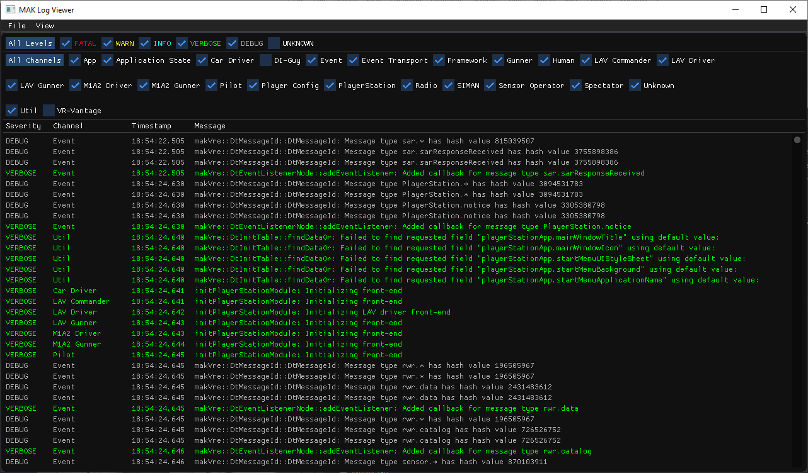

# logViewer
Tool to make it easier to view log files

## Log Viewer in action

## Usage
Log files may be opened from the menu or dragged onto the application.  

Clicking on a severity level or channel name will toggle viewing messages that match.  Clicking the "All" button will turn on all channels or severity levels.  
Shift-Clicking on a channel or severity level will turn off all other channels and turn on the channel clicked (solo select).  

## Formating 
Log files formated as will be parsed and decoded: 

Severity[Channel] Timestamp Message

Severity can be any of the following:
FATAL
WARN
INFO
VERBOSE
DEBUG

## Building
Uses premake in build directory.  Simply run: 

premake5.exe vs2017 

Binary executable is in bin directory if you don't want to build.
